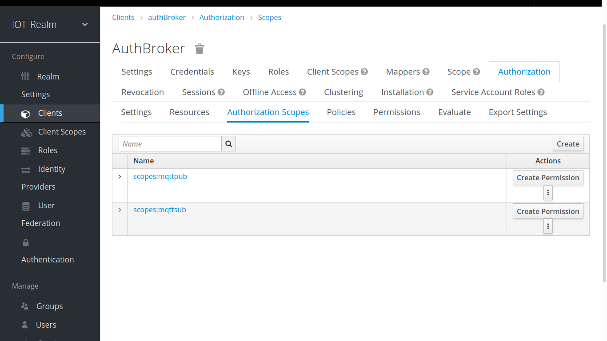
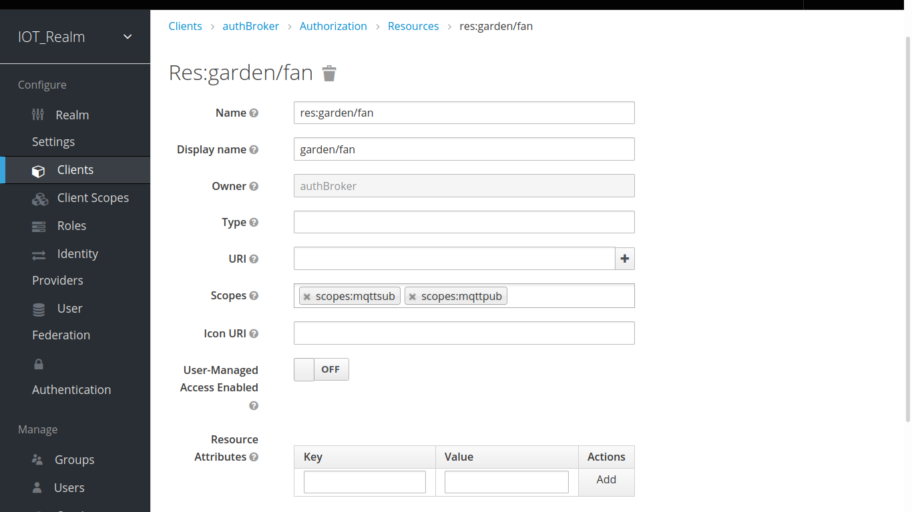

# Authentication and Authorization Module for Brokers

[](https://github.com/ellerbrock/open-source-badges/) [](https://travis-ci.com/authbroker/authbroker)

<div align="center">
     
</div>

Authentication and Authorization module of HTTP/MQTT/CoAP Brokers based on NodeJS for IoT or Internet of Things. This repo is under development.


##  Getting Started

* Install [Keycloak](https://www.keycloak.org/) locally. Make sure it's working.
* If you want to run a test locally, clone this repo.

``` bash
git clone https://github.com/authbroker/authbroker
cd authbroker
npm install
bash run-test.sh
# visit http://localhost:8080
# with username 'admin' and password 'admin'
npm run test

# for stopping docker instance you use this
docker stop $(docker ps -a -q --filter ancestor=authbroker:test --format="{{.ID}}")
```

It runs Keycloak by docker and import demo data to IOT_Realm realm. An example Broker runs that used auhtBroker by:

``` bash
node ./example/broker.js
```
these below commands Subscribe and Publish to broker.

```bash
mosquitto_sub -h localhost -p 1883 -t garden/fan -u admin -P admin

mosquitto_pub -h localhost -p 1883 -t garden/fan -m "hello world" -u admin -P admin
```

if username/password or authorization permission in Keycloak changes, authBroker authorization will not permitted to broker. for example change topic to unauthorized topic like garden/unathorized and see how broker reject it.


## How Using it
This module use Node-style callback and it can be used with different brokers like [Aedes](https://github.com/mcollina/aedes).


``` js
const aedes = require("aedes")({
    persistence: new require("aedes-persistence")()
});
const server = require("net").createServer(aedes.handle);
const port = 1883;

const authBroker = require('@authbroker/authbroker');

const config = {
        "realm": "IOT_Realm",
        "authUrl": "http://localhost:8080/auth",
        "sslRequired": "external",
        "clientId": "authBroker",
        "verifyTokenAudience": true,
        "credentials": {
          "secret": "secret"
        },
        "confidentialPort": 0,
        "policyEnforcer": {},
        "mqttpubScope": "scopes:mqttpub", // scope text for pub permission
        "mqttsubScope": "scopes:mqttsub", // scope text for pub permission
        "mqttResPerfix": "res:" // prefix text for resource or topic
      };

const authbroker = new authBroker(config)

// hook it up
aedes.authenticate = authbroker.authenticate();
aedes.authorizeSubscribe = authbroker.authorizeSubscribe();
aedes.authorizePublish = authbroker.authorizePublish();

server.listen(port, function () {
    console.log("server listening on port", port);
});
```

It's necessary to set these scopes in Authorization section in Keycloak.
By defualt 'scopes:mqttpub' is set for Publish permission and 'scopes:mqttsub' is set for Subscription permission.



Users can Publish or Subscribe to resources which has a scope 'scopes:mqttpub' or 'scopes:mqttsub'.



run-test.sh script runs a preconfigured  Keycloak Demo version that can be used as a template.

```bash
bash run-test.sh
```
then visit http://localhost:8080 with username 'admin' and password 'admin' in Admin console.

## Contributing

[](https://github.com/dwyl/esta/issues)

Anyone with interest in or experience with the following technologies are encouraged to join the project.
And if you fancy it, join the [Telegram group](t.me/joinchat/AuKmG05CNFTz0bsBny9igg) here for Devs and say Hello!


## Authors / Contributors

* [Hadi Mahdavi](https://twitter.com/kamerdack)


## Credits / Inspiration

* Matteo Collina for Mosca, Aedes, Ponte (https://github.com/moscajs/aedes)
* Eugenio Pace for Auth0 Mosca inspiration (https://github.com/eugeniop/auth0mosca)


## Copyright

MIT - Copyright (c) 2019-2022 ioKloud
